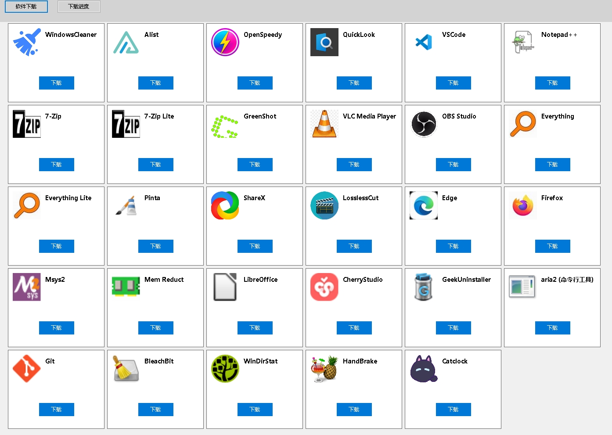

# AppStore - Windows应用商店



一个简单的Windows应用商店应用，提供软件下载和管理功能。

## 功能特点

- 简洁的软件下载界面
- 下载进度管理
- 支持后台下载
- 美观的应用卡片展示

## 构建与打包

### 系统要求
- .NET 8.0 SDK
- Windows 10/11

### 打包指令

#### 32位版本
```bash
dotnet publish -c Release -r win-x86 -p:PublishSingleFile=true
```

#### 64位版本
```bash
dotnet publish -c Release -r win-x64 -p:PublishSingleFile=true
```

打包后的可执行文件将包含指定的应用程序图标，输出路径为：
```
bin\Release\net8.0-windows\[platform]\publish
```

### 高级选项
- 添加`--self-contained true`可生成独立包（体积较大）
- 添加`-p:PublishTrimmed=true`可减小包体积（实验性）

## 项目结构

```
AppStore/
├── MainForm.cs          # 主窗体逻辑
├── DownloadManager.cs   # 下载管理
├── AppCard.cs           # 应用卡片控件
├── DownloadItem.cs      # 下载项控件
├── img/                 # 图片资源
│   ├── ico/             # 图标文件
│   └── png/             # 应用截图
└── resource/            # 资源文件
    └── aria2c.exe       # 下载工具
```

## 运行要求

- .NET 8.0运行时（如果使用框架依赖发布）
- Windows 10或更高版本

## 许可证

MIT License

Copyright (c) 2025 kortapp-z项目组
